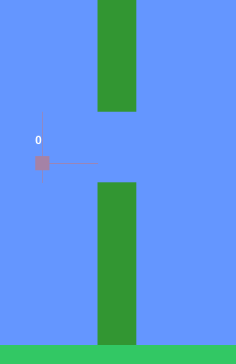

# Flappy Bird - Genetic Algorithm

This repository contains a Python implementation of a genetic algorithm applied to the Flappy Bird game using Pygame. The genetic algorithm is used to evolve a neural network that controls the bird's behavior in the game.



## Requirements

- Python 3.x
- Pygame

# Installation

You can install Pygame using pip, Python's package manager. Run the following command in your terminal or command prompt:

```bash
pip install pygame
```
<br></br>
# Overview
### The project consists of several components:

- **Player:** Represents the bird in the game. It has its own neural network (Brain) and handles interactions with the game environment.

- **Ground:** Represents the ground in the game.

- **Pipes:** Represents the obstacles (pipes) in the game.

- **Brain:** Contains the neural network implementation responsible for making decisions for the bird.

- **Population:** Manages a population of players, evolves them over generations using genetic algorithms, and handles species management.

- **Species:** Represents a group of players with similar neural networks. Helps maintain diversity within the population.

- **Nodes**: Individual nodes within the neural network, responsible for processing inputs and producing outputs.

- **Connections**: Connections between nodes in the neural network, representing weighted connections that transmit signals

<br></br>

## Usage

### To run the game:

Make sure you have Python and Pygame installed.
Clone the repository.
Navigate to the repository directory.
Run the main.py file.
```bash
python main.py
```